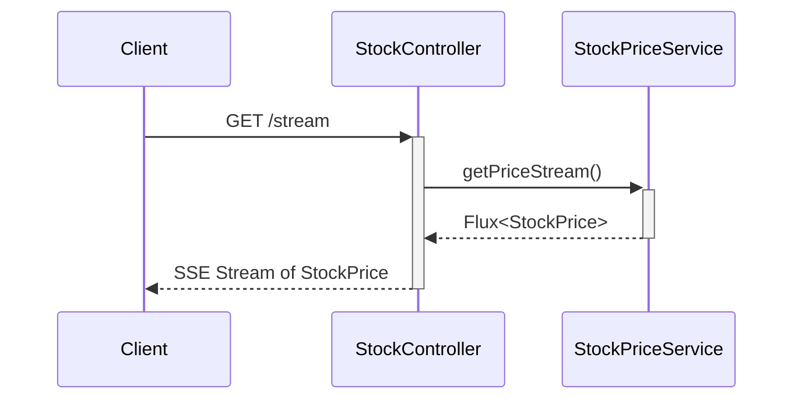

# ⚡ Reactive Web Server with Spring WebFlux

> A blazing-fast, non-blocking, reactive web server that streams real-time stock price updates using Spring Boot WebFlux and Java 21.

---

## 📌 Overview

This project demonstrates how to build an end-to-end **Reactive Web Server** using:

- **Java 21**
- **Spring Boot 3.2.x**
- **Spring WebFlux**
- **Reactor (Project Reactor)**
- **Netty Server (Non-blocking I/O)**

The application simulates a real-world **financial trading platform**, streaming stock prices to thousands of concurrent users in real time with **zero thread contention**.

---

## 🧠 Key Concepts Covered

| Concept                 | Description                                                                 |
|-------------------------|-----------------------------------------------------------------------------|
| 🔁 Reactive Programming | Non-blocking, asynchronous event-driven flow using `Mono` and `Flux`         |
| 🔗 Backpressure         | Server adapts to clients' ability to consume data, preventing overload       |
| 🧵 Thread Efficiency    | One thread can handle thousands of connections using Netty                   |
| 🧪 SSE Streaming        | Real-time updates using Server-Sent Events (`text/event-stream`)             |
| 📐 Functional Composition | Declarative data flow using Reactor's stream operators                     |
| ♻️ Hot Publisher Sharing | Efficient broadcasting of stream to multiple clients using `share()`       |

---

## 📁 Project Structure

```text
reactive-web-server/
├── src/
│   └── main/
│       ├── java/com/example/reactivewebserver/
│       │   ├── ReactiveWebServerApplication.java  # Boot app entry
│       │   ├── controller/
│       │   │   └── StockController.java           # REST API for streaming
│       │   ├── service/
│       │   │   └── StockPriceService.java         # Emits live prices
│       │   └── model/
│       │       └── StockPrice.java                # StockPrice data model
│       └── resources/
│           └── application.yml                    # Server config
├── pom.xml                                         # Maven setup
└── README.md                                       # Project documentation
```

---

## 🚀 How It Works – Flow of Execution

```text
Client sends GET request to /stream
      ⮕ StockController handles it via WebFlux
          ⮕ Delegates to StockPriceService
              ⮕ Returns a Flux that emits StockPrice every second
                  ⮕ Stream is shared across all clients (hot stream)
                      ⮕ Output sent as SSE (Server-Sent Events)
```

---

### 🧬 Sequence Diagram
https://xventureglobalsolutions-my.sharepoint.com/:u:/g/personal/malinda_g_x-venture_io/EcuFOClXhuxHjwkH-rcPO78Ba96RjDLsLarIKl9QS8KR2A?e=hKDH9G


---

## 💡 Example Output (SSE)

```text
data: {"symbol":"AAPL","price":151.32,"time":"2025-04-24T13:00:11.123Z"}
data: {"symbol":"AAPL","price":152.21,"time":"2025-04-24T13:00:12.123Z"}
data: {"symbol":"AAPL","price":149.99,"time":"2025-04-24T13:00:13.123Z"}
```

---

# Applying Reactive Principles with Java Streams

This document outlines how Reactive Manifesto principles are applied in a project, leveraging Java Streams for efficient data handling and Project Reactor for reactive streams.

## 🏗️ Reactive Manifesto Principles Applied

| Principle    | Application in Project                                                                                                                               |
|--------------|--------------------------------------------------------------------------------------------------------------------------------------------------------|
| **Responsive** | The system responds promptly through non-blocking asynchronous flows and includes fallback error handling mechanisms.                               |
| **Resilient** | Retries (`retryWhen`) and error recovery strategies (`onErrorResume`) are implemented to ensure the system remains available even in the face of failures. |
| **Elastic** | The system scales automatically as multiple clients share the same hot data stream (`share()`), optimizing resource utilization.                       |
| **Message-driven** | Data flows through Reactor's event streams (`Flux`), guaranteeing asynchronous message propagation throughout the system.                            |

## 🧩 Java Streams Usage in Service Layer

The service layer utilizes Java Streams to enhance data processing. Here's a comparison with traditional loop-based approaches:

| Traditional Loops (Old Way)             | Modern Java Streams (New Way)                                        |
|-----------------------------------------|---------------------------------------------------------------------|
| Manual for-loops to create a list of stock prices | `IntStream.range().mapToObj().collect(Collectors.toList())`        |
| Manual filtering of data                | `.filter(price -> price.price() > 148)`                             |
| Manual collection of results into a list | `.collect(Collectors.toList())`                                     |

✅ **Key Benefit:** Java Streams make data handling **declarative**, **composable**, and readily **parallelizable** when performance demands it.

## 🔄 Relationship Between Java Streams and Reactive Streams

Understanding the connection between Java Streams and Reactive Streams (as implemented by Project Reactor) is crucial:

| Aspect            | Java Streams                     | Reactive Streams (Project Reactor) |
|-------------------|----------------------------------|-----------------------------------|
| **Data Nature** | Finite collections               | Infinite, real-time sequences     |
| **Processing Mode** | Pull-based (consumer-driven)     | Push-based (producer-driven)      |
| **Concurrency** | Synchronous by default           | Asynchronous and non-blocking     |
| **Error Handling**| Limited to `try-catch` blocks    | Built-in operators like `retry`, `onErrorResume` |
| **Example Usage** | `List.stream().filter().map()`  | `Flux.filter().map().flatMap()`   |

🔗 **Conclusion:** Reactive programming, particularly with Project Reactor, **extends** the capabilities of Java Streams to effectively handle **infinite data streams**, enable **non-blocking execution**, and provide robust mechanisms for **resilience**.


## 🛠️ Setup & Run

### 1. Clone the Project

```bash
git clone https://github.com/your-user/reactive-web-server.git
cd reactive-web-server
```

### 2. Build & Run the Application

```bash
mvn clean install
mvn spring-boot:run
```

### 3. Access the Stream

- Browser: [http://localhost:8080/stream](http://localhost:8080/stream)
- Curl:

```bash
curl http://localhost:8080/stream
```

---

## 🏗️ Technology Stack

| Tech              | Purpose                                   |
|-------------------|-------------------------------------------|
| Java 21           | Latest LTS release with record, Streams   |
| Spring Boot 3.2.x | Rapid Bootstrapping Framework             |
| Spring WebFlux    | Reactive programming model                |
| Project Reactor   | Core reactive library (`Flux`, `Mono`)    |
| Netty             | High-performance Non-blocking HTTP server |
| SSE               | Streaming updates via HTTP                |
| Lombok            | Less boilerplate code                     |
| Maven             | Dependency management                     |

---

## 📊 Real-World Use Case

A financial platform broadcasting real-time **stock ticker prices**:
- 10,000+ users connected simultaneously
- Users receive per-second price updates
- No thread blocking
- Handles load without increasing resource usage
- Ideal for dashboards, real-time monitors, and alerting systems

---

## 📦 Architecture Overview

```text
Client  <--->  Controller (WebFlux)  <--->  Service (Reactive Stream)  <--->  Event Loop (Netty)
                     ↑                        ↑
             Backpressure Enabled     Reactive Flux of Events
```

---

## 🧪 Test It With Multiple Tabs or Clients

Open [http://localhost:8080/stream](http://localhost:8080/stream) in multiple browser tabs or run multiple curl commands to connect to /stream.

> All clients share the same live Flux — no duplication of resources, no blocking, no scaling issues.

---

## 📌 Next Steps (Optional Extensions)

- ✅ Add MongoDB with `ReactiveMongoRepository`
- ✅ Expose WebSocket endpoint for 2-way communication
- ✅ Deploy with Docker & Kubernetes
- ✅ Secure endpoints with OAuth2

---

## 📌 Potential Future Enhancements
🔥 Add WebSocket endpoints for bi-directional communication

🗄️ Integrate MongoDB with Reactive CRUD Repositories

☁️ Deploy via Docker and Kubernetes for cloud-native scaling

🔐 Implement OAuth2 security for API protection

📈 Integrate metrics for live monitoring and health checks

---

## 👨‍💻 Author

Crafted with ❤️ by Malinda Gamage – Expert Java Backend Developer & Reactive Systems Engineer.

---

## 🧾 License

MIT License. Free to use, improve, and build amazing reactive systems.